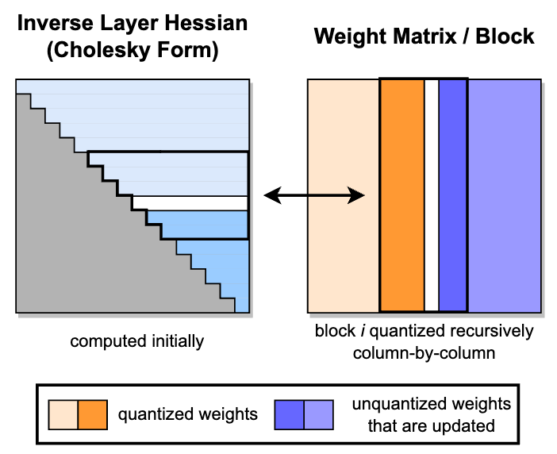
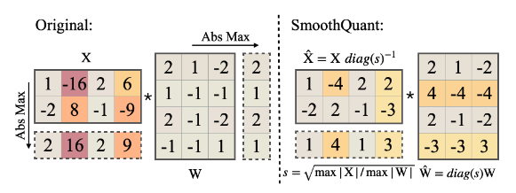
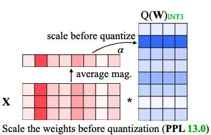

# Awesome-LLM-Quantization

  
  
  
  
  
 
   

Welcome to the Awesome-LLM-Quantization repository! This is a curated list of resources related to quantization techniques for Large Language Models (LLMs). Quantization is a crucial step in deploying LLMs on resource-constrained devices, such as mobile phones or edge devices, by reducing the model's size and computational requirements.

## Contents

This repository contains the following sections:

- **Papers**: A collection of research papers and articles on quantization techniques for LLMs.
- **Tutorials**: Step-by-step guides and tutorials for implementing quantization methods.
- **Libraries**: A list of open-source libraries and frameworks that support quantization for LLMs.
- **Datasets**: Datasets commonly used for benchmarking and evaluating quantized LLMs.
- **Tools**: Useful tools and utilities for quantization and deployment of LLMs.

## Papers 

| Title & Author & Link                                        | Introduction                                                 | Summary                                                      |
| ------------------------------------------------------------ | ------------------------------------------------------------ | ------------------------------------------------------------ |
|  [GPTQ: Accurate Post-Training Quantization for Generative Pre-trained Transformers](https://arxiv.org/abs/2210.17323)   Elias Frantar, Saleh Ashkboos, Torsten Hoefler, Dan Alistarh   [Github](https://github.com/IST-DASLab/gptq) |  | This Paper is the first one to apply post-training quantization to GPT. GPTQ is a one-shot weight quantization method based on approximate second-order information(Hessian). The bit-width is reduced to 3-4 bits per weight. Extreme experiments on 2-bit and ternary quantization are also provided. |
|  [SmoothQuant: Accurate and Efficient Post-Training Quantization for Large Language Models](https://arxiv.org/abs/2211.10438)   Guangxuan Xiao, Ji Lin, Mickael Seznec, Hao Wu, Julien Demouth, **Song Han**   [Github](https://github.com/mit-han-lab/smoothquant) |  | SmoothQuant is a post-training quantization framework targeting W8A8 (INT8). In General, weights are easier to quantize than activation. It propose to migrate the quantization difficulty from activations to weights using mathematically equivalent transformation using $ s=\text{max}(|X|)^\alpha \div \text{max}(|W|)^{1-\alpha}$. |
|  [AWQ: Activation-aware Weight Quantization for LLM Compression and Acceleration](https://arxiv.org/abs/2306.00978)  Ji Lin, Jiaming Tang, Haotian Tang, Shang Yang, Wei-Ming Chen, Wei-Chen Wang, Guangxuan Xiao, Xingyu Dang, Chuang Gan, Song Han, **Song Han**   [Github](https://github.com/mit-han-lab/llm-awq) |  | Activation-aware Weight Quantization (AWQ) is low-bit weight-only quantization method targeting edge devices with W4A16. The motivation is protecting only 1% of sliant weighs can retain the performance. Then, AWQ aims to search for the optimal per-channel scaling $s^*=argmin_{s}||Q(W\cdot diag(s))(diag(s)^{-1}\cdot X)-WX||$ to protect the salient weights by observing the activation. Then, we have $Q(w\cdot s)\cdot \frac{x}{s}$. |
|  [BiLLM: Pushing the Limit of Post-Training Quantization for LLMs](https://arxiv.org/abs/2402.04291)   Wei Huang, Yangdong Liu, Haotong Qin, Ying Li, Shiming Zhang, Xianglong Liu, Michele Magno, Xiaojuan Qi   [Github](https://github.com/Aaronhuang-778/BiLLM) |  | BiLLM is the first 1-bit post-training quatization framework for pretrained LLMs. BiLLM split the weights into salient weight and non-salient one. For the salient weights, they propose the binary residual approximation strategy. For the unsalient weights, they propose an optimal splitting search to group and binarize them independently. BiLLM achieve 8.41 ppl on LLaMA2-70B with only 1.08 bit. |
|                                                              |                                                              |                                                              |

## Contributing

Contributions to this repository are welcome! If you have any suggestions for new resources, or if you find any broken links or outdated information, please open an issue or submit a pull request.

## License

This repository is licensed under the [MIT License](https://opensource.org/licenses/MIT).
